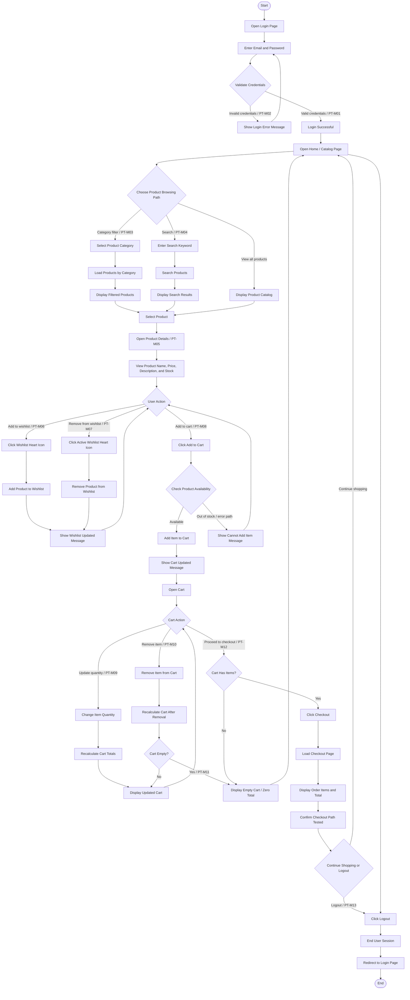

# Overall Path Testing Flow Graph

The following flow graph combines the important manual path testing scenarios for the Datamak Technologies e-commerce system into one complete user-flow diagram.

## Path ID Mapping

| Path ID | Path Name | Flow Covered |
|---|---|---|
| PT-M01 | Successful login path | Start to valid credentials to catalog |
| PT-M02 | Invalid login path | Invalid credentials to error message and retry |
| PT-M03 | Product category path | Catalog to category filter to filtered products |
| PT-M04 | Product search path | Catalog to search keyword to search results |
| PT-M05 | Product details path | Product selection to details page |
| PT-M06 | Wishlist add path | Product action to add wishlist and confirmation |
| PT-M07 | Wishlist remove path | Active wishlist item to removal and confirmation |
| PT-M08 | Add to cart path | Product action to cart update |
| PT-M09 | Cart update path | Cart quantity change to recalculated totals |
| PT-M10 | Cart remove path | Remove cart item to recalculated cart |
| PT-M11 | Empty cart path | All items removed to empty cart / zero total |
| PT-M12 | Checkout path | Cart with items to checkout page and order total |
| PT-M13 | Logout path | User session ended and redirected to login |

## Figure Caption

Figure X: Overall path testing flow graph for the Datamak Technologies e-commerce system.

## Explanation

This overall path testing flow graph represents the main execution paths tested manually in the Datamak Technologies e-commerce system. It combines authentication, product browsing, category filtering, search, product details, wishlist, cart, checkout, empty cart, error handling, and logout paths into one complete user journey. The green/success paths represent normal user flows, while the alternative branches represent invalid login, out-of-stock/cart error handling, wishlist removal, item removal, and empty-cart outcomes.
